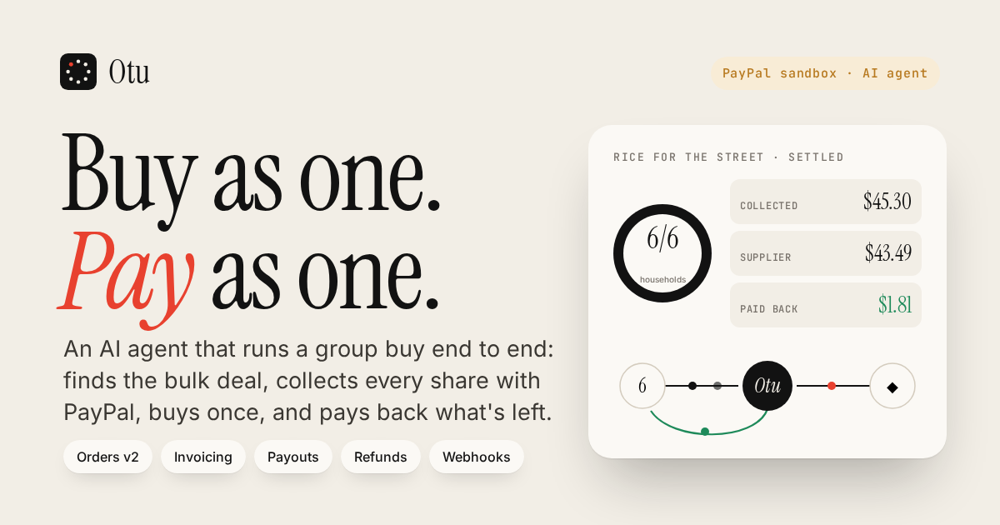
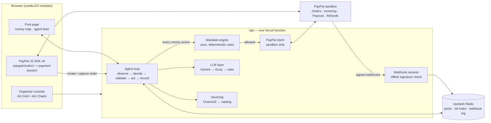
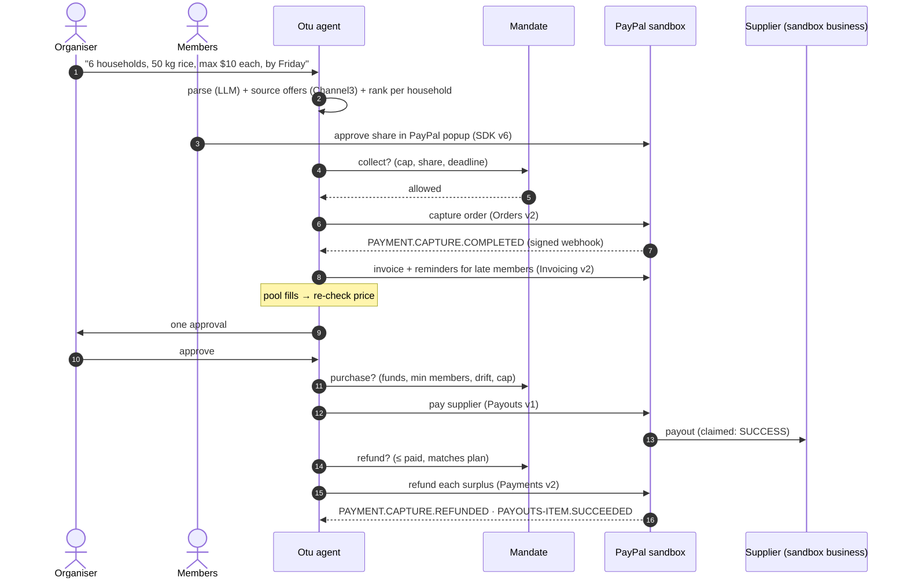
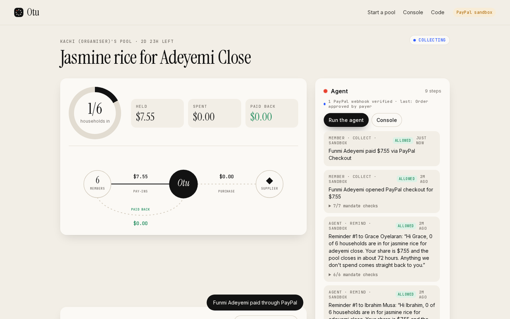
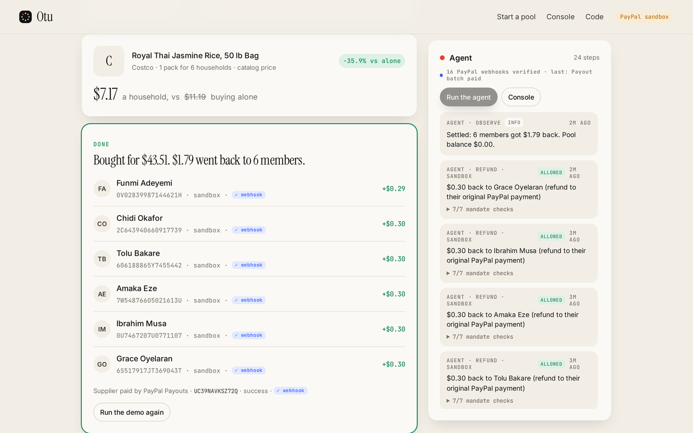
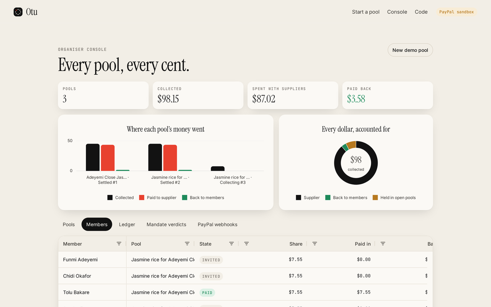

<p align="center"></p>

# Otu — buy as one

**An AI agent that runs a group buy end to end on PayPal: it sources the bulk deal, collects every member's share, chases the late ones, buys once when the pool fills, and pays back what's left — to the cent.**

> *Otu* is Igbo for "one".

**Live demo: https://otu.vercel.app** · PayPal **sandbox only** — no real money ever moves.

---

## For judges (2 minutes)

| | |
|---|---|
| Live app | https://otu.vercel.app → **Open a live demo pool** |
| PayPal sandbox buyer | **otu.judge1578@example.com** |
| Password | **OtuJudge1578!** |
| Organiser console | https://otu.vercel.app/console |
| Health / config | https://otu.vercel.app/api/health |

1. Open a demo pool. Pick a member under **Pay as** and press the PayPal button. Log in with the sandbox buyer above and approve. The ring ticks up, the row turns green, and a few seconds to minutes later a blue **✓ PayPal** badge appears: that is PayPal's signed webhook confirming the capture.
2. Press **Run the agent**: unpaid members get a real PayPal invoice with a reminder the agent wrote.
3. Press **Demo: pay the other N** to fill the pool with real sandbox card captures.
4. The agent re-checks the price and asks for **one approval**. Approve.
5. Watch the money map: the supplier is paid with **Payouts** (to a separate sandbox account standing in for the retailer, which claims it), then every member's leftover is **refunded to the cent**.
6. Open **/console** → the **PayPal webhooks** tab lists every delivery and how its signature was verified.

The buyer above is a PayPal *sandbox* account; it only works on sandbox.paypal.com. No account? In the PayPal window choose **Pay with Debit or Credit Card** and use any sandbox test card (for example `4032 0358 0974 2661`, any future expiry, CVV `123`). If PayPal asks for a phone code in sandbox, `111111` works.

## The problem

When food prices climb, neighbours split bulk bags of rice, oil and beans between households. A 50 lb bag split six ways costs each family about a third less than buying a small bag alone. It works, and today it runs on one tired organiser, a group chat, a spreadsheet and a pile of transfers to chase. Someone fronts the money, someone chases the late payer, someone does the maths at the end. That is where it breaks.

## What Otu does

1. **The organiser just says what the group wants**: *"Six of us want jasmine rice, about 8 lb each. Close it Friday, nobody pays more than $14."*
2. **The agent drafts the pool**: it reads the request, sources offers across retailers (Channel3), prices each one *per household* against what a family would pay alone, picks the best and explains why.
3. **Members pay their share with PayPal** (Orders v2 + JavaScript SDK v6). Each share carries a small buffer for price movement, which comes back later.
4. **Late members get a real PayPal invoice** (Invoicing v2) with a reminder the agent writes like a neighbour would, inside a reminder budget.
5. **When the pool fills, the agent re-checks prices**, rescales the order to the households that actually paid, and asks the organiser for **one approval**.
6. **It pays the supplier** (Payouts v1) and **refunds every member's surplus to their original PayPal payment** (Payments v2 refunds), exact to the cent.
7. **PayPal's signed webhooks close the loop**: captures, refunds, payout items and paid invoices are matched back to their pool and stamped on the ledger. A late member who pays their invoice is marked paid by the `INVOICING.INVOICE.PAID` webhook alone.
8. If the pool misses its minimum by the deadline, **everyone gets everything back automatically**.

## Architecture



### The money loop



## The mandate: the agent proposes, the rules decide

The model never touches money directly. Every money action — pay-in, reminder, purchase, refund, payout — is validated by a deterministic, pure rule engine ([`lib/mandate.js`](lib/mandate.js)) before anything is sent to PayPal, and every verdict (each rule's pass/fail and detail) lands in the pool's audit trail.

| Rule | What it enforces |
|---|---|
| `member_cap` | nobody pays more than the cap the organiser set |
| `matches_share`, `not_already_paid` | exact share, once |
| `deadline`, `pool_open` | no pay-ins after close |
| `min_members` | no purchase below the minimum paid members |
| `price_drift` | if the re-checked price rose more than 5% over what members paid against, the agent must ask again |
| `per_member_cost_under_cap` | the rescaled order still respects the cap |
| `funds_cover`, `single_purchase` | it can only spend what it holds, once |
| approval | the purchase waits for the organiser |
| `within_member_paid`, `matches_plan`, `has_capture` | refunds never exceed what a member paid, and go back to their own capture |
| `reminder_budget`, `reminder_spacing` | at most 3 reminders, 12 h apart |

All money is integer cents; splits use exact remainder distribution, so `collected = spent + returned + held` always balances (see the tests).

## PayPal integration

| PayPal product | Used for | Code |
|---|---|---|
| **JavaScript SDK v6** | `<paypal-button>` web component + `createPayPalOneTimePaymentSession`; the browser-safe client token comes from our server | `public/assets/js/views/pool.js`, `GET /api/paypal/client-token` |
| **Orders v2** | each member's pay-in: created on our server, approved in PayPal, captured on our server | `lib/paypal.js` `createOrder`, `captureOrder` |
| **Orders v2** with a sandbox test card | the "demo crowd" that fills a pool on camera with real sandbox captures | `payWithTestCard` |
| **Invoicing v2** | reminder invoices for late members: create, send, remind, QR | `createInvoice`, `sendInvoice`, `remindInvoice`, `invoiceQr` |
| **Payouts v1** | paying the supplier once the organiser approves; surplus route when a capture can't be refunded | `payout` |
| **Payments v2 refunds** | surplus back to each member's original capture (`custom_id` = pool) | `refundCapture` |
| **Webhooks** | 18 event types; verified, logged, matched to their pool, stamped on the ledger | `verifyWebhook`, `POST /api/paypal/webhook` |

**Webhook verification.** The receiver reads the exact raw body and checks PayPal's signature offline — `transmission_id|transmission_time|webhook_id|crc32(body)` verified with SHA256withRSA against PayPal's certificate, fetched only from a `paypal.com` host — and falls back to PayPal's `verify-webhook-signature` API. Unverified deliveries are logged and rejected. Every PayPal id Otu creates (order, capture, refund, payout batch, invoice) is indexed back to its pool, so events that don't echo `custom_id` still land on the right ledger.

**Idempotency.** Every money call carries a `PayPal-Request-Id`, so a retried request can never double-charge or double-refund. The PayPal module refuses to run against live PayPal.

**A stable checkout.** The pool page polls for live updates, but it patches only the regions whose content changed, keys member rows and feed items, and never rebuilds the PayPal button while a member is mid-payment (the QA script asserts the button element survives other members paying).

## AI

- **Request → pool spec**: the model turns a messy message into item, unit, quantity per household, households, cap, minimum and deadline (JSON mode).
- **Offer reasoning**: it explains the pick in plain words with the numbers.
- **Reminders**: short, warm, never guilt-tripping, escalating gently with each reminder.
- Providers: Google Gemini first, Groq second, deterministic rules as the last fallback, so the product keeps working with no keys at all. The provider used for each step is shown in the UI.

## Sponsor tools

- **AG Grid (Community, MIT)** — the organiser console (`/console`): pools, members, the full ledger, every mandate verdict and every PayPal webhook in live grids (row ids + cell-change flashing as webhooks and pay-ins land, pinned total rows, custom renderers, quartz theme matched to the brand).
- **AG Charts (Community, MIT)** — "Where each pool's money went" (collected / paid to supplier / back to members per pool) and "Every dollar, accounted for" (a donut of supplier, refunds and money still held).
  - *Why Community and not Enterprise:* row grouping and integrated charts are Enterprise features. AG Grid lets you evaluate Enterprise locally without a key, but a hosted demo needs a licence, and the free trial licence lasts 30 days, which would expire before judging ends. Otu stays on the MIT editions so the public demo is licensed for its whole life.
- **Channel3** — live offer sourcing over its product graph (`POST /v1/search`): the agent filters out look-alikes (a search for "rice" also returns rice cookers), parses pack sizes from titles and descriptions, drops listings with implausible unit prices and keeps the cheapest listing per retailer. For staples Channel3 doesn't index yet (bulk rice, oil), a curated catalog answers through the same interface, and the UI always says which source an offer came from.

## Run it

```bash
git clone https://github.com/zxreigns/otu && cd otu
cp .env.example .env   # optional: fill in sandbox keys
npm run dev            # http://localhost:8790  (zero dependencies)
npm test               # mandate, money and settlement tests
```

With no keys it runs fully: payments go through a built-in sandbox simulator (every record is marked `simulated`), sourcing uses the catalog and the agent uses rules. Add `PAYPAL_CLIENT_ID` / `PAYPAL_CLIENT_SECRET` from a PayPal **sandbox** app to switch every money step to the real sandbox APIs, `PAYPAL_SUPPLIER_EMAIL` (any existing sandbox account created in the developer dashboard) to have supplier payouts claimed, and `PAYPAL_WEBHOOK_ID` once you register `https://<your-host>/api/paypal/webhook` in the app.

## Layout

```
api/index.js        one zero-dependency Vercel function: the whole API + webhook receiver
lib/mandate.js      the rule engine (pure, deterministic)
lib/pool.js         quoting, shares, settlement maths
lib/agent.js        the loop: observe → decide → validate → act → record
lib/paypal.js       PayPal sandbox REST client (+ webhook signature check) and a simulator with the same interface
lib/sourcing.js     Channel3 adapter + catalog fixture
lib/llm.js          Gemini / Groq / rules
lib/store.js        Upstash Redis REST or memory; PayPal reference index; webhook log
public/             the app (vanilla ES modules, PayPal JS SDK v6, AG Grid + AG Charts Community)
dev/                local server + end-to-end screenshot/stability script
test/               node --test
```

## Screens

| Pool, mid-payment | Settled | Console |
|---|---|---|
|  |  |  |

## License

MIT
